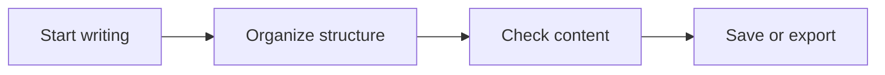

# Welcome to MarkLeaf!

This is a simple but feature-rich Markdown text editor. It is said that fcz originally developed MarkLeaf simply to make Markdown text layout look like book pages, which is how it got its name.

Nice to meet you. We hope this document will help you quickly become familiar with MarkLeaf. Try editing its content and experimenting with different formats and features.

## What can MarkLeaf do?

MarkLeaf is a text editor mainly for writing and formatting with Markdown. Markdown uses simple markers to represent document structure. In visual mode, you can complete these operations through the menus and the paragraph format button. Common operations also have familiar keyboard shortcuts. Trying the shortcuts can make these features easier to use.

### Headings

In visual mode, you can set a heading through a menu item or the paragraph format button. You can also type `#` followed by a space, which automatically converts the paragraph into a heading.

In source mode, add `#` before the text to create a heading. The number of `#` characters indicates the heading level, for example:

```markdown
# Heading 1
## Heading 2
### Heading 3
```

Headings appear automatically in the outline. Click an outline item to jump to the corresponding section.

### Inline formatting

- `**bold**` is displayed as **bold**
- `*italic*` is displayed as *italic*
- `***bold italic***` is displayed as ***bold italic***
- `~~strikethrough~~` is displayed as ~~strikethrough~~
- `++underline++` is displayed as ++underline++
- `==highlight==` is displayed as ==highlight==

After selecting text, you can use the Format menu or context menu to apply these styles. You can also type a closed pair of these markers in the editor, and the enclosed text will automatically become the corresponding format.

### Lists

Markdown provides three different kinds of lists:

#### Unordered lists

This is a list using `-` as its prefix:

- Record an idea
- Organize related information
- Complete the first draft

#### Ordered lists

This is a list using `1.` as its prefix:

1. Write the content
2. Check the format
3. Save and export

#### Task lists

This is a list using `[ ]` as its prefix. `[x]` means that the task is complete:

- [x] Install and open MarkLeaf
- [ ] Create your first document
- [ ] Try exporting to HTML or PDF

When the cursor is in a list item, press `Tab` to increase indentation and make it a child item, or press `Shift+Tab` to reduce indentation.

### Quotes and code blocks

Use `>` to create a blockquote. The number of `>` characters represents the quote level. Text in a blockquote looks like this. Start a new line, type a greater-than sign, and press the space key to see how the formatting changes.

> The red dusk of nightfall, makes my tears want to leave, your image inside me is fading.

Use three backticks to create a code block and declare its language at the beginning:

```python
message = 'Hello, MarkLeaf!'
print(message)
```

### Tables

You can create a table from the menu or by pressing `Ctrl+T`, then edit its contents as shown below.

> tablecaption: **Table 1:** MarkLeaf's main features


| Feature        | Purpose                                                       |
| -------------- | ------------------------------------------------------------- |
| Visual editing | Focus on content without constantly handling Markdown markers |
| Source editing | Precisely control Markdown text                               |
| Workspace      | Manage multiple documents in the same folder                  |
| Outline        | Browse the heading structure and jump quickly                 |
| Export         | Generate content for sharing and printing                     |


With the cursor in a table, you can use the table menu to add or delete rows and columns and adjust alignment. Unlike other editors, here you can **set a table caption**. Try clicking “Edit table caption” in the context menu.

### Inline formulas

Wrap LaTeX content in a pair of closed dollar signs to insert an inline formula. For example, `$E=mc^2$` renders as: $E=mc^2$.

For another example, the Pythagorean theorem is: $a^2+b^2=c^2$.

> Now try typing a dollar sign on each side of this formula and see what it becomes!
>
> \\int\_a^b f(x) \\, dx = F(b) - F(a) = F(x) \\Big|\_a^b

### Block formulas

Longer formulas can occupy their own paragraph. They are wrapped with two dollar signs on each side.

$$\int_{-\infty}^{+\infty} e^{-x^2}\,dx=\sqrt{\pi}$$

You can insert a formula through the menu or directly enter its LaTeX source. Right-clicking a formula also lets you switch it between a block formula and an inline formula.

### Footnotes

Type a closed footnote reference in the body, such as `[^1]`, and MarkLeaf will display it as a superscript. Put the footnote definition at the beginning of a paragraph:

This is a sentence with additional information[^1].

[^1]: Footnotes can contain **bold**, *italic*, and `inline code`, and also support inline formulas $x^2+y^2$. Hover over the footnote number in the body to preview it.

Hold `Ctrl` and click a footnote reference to jump to its definition. Hold `Ctrl` and click the definition to return to the reference.

### Mermaid diagrams

MarkLeaf can render code blocks whose language is marked as `mermaid` as supported diagrams:



You can insert an empty Mermaid diagram through the menu, enter its source, and render it. You can also edit and refresh the diagram.

### Images and links

Markdown links and images are written as follows. However, you can insert them directly through the “Format &gt; Hyperlink” or “Format &gt; Image” menus without writing the source yourself:

```markdown
[Link text](https://example.com)

```


The inserted image is displayed in the document like this. You can rotate and resize it, and right-click it to add a caption.

## Using MarkLeaf comfortably

### Typography styles and color themes

Use “View &gt; Typography Style” to change the layout of rendered Markdown text. Each style has a unique character, for example:

- The Print style provides the feel of a paper book;
- The LaTeX style makes your text look as if it were rendered with LaTeX.

In addition, we provide dozens of preset color schemes, including dark and light themes. Choose one you like and give it a try!

In fact, all themes are CSS files. This means you can create your own typography styles and color themes. Any properly formatted themes placed in the themes folder will be detected.

### Paragraph format button

Hover over a paragraph and you will see a small rectangular button near its upper-left corner. Clicking it opens many shortcuts for paragraphs and formatting. Use it to quickly adjust the paragraph format.

### Minimal mode

Press `F11` to switch to Minimal Mode. In this mode, only the article itself is shown, without any other distractions, so you can focus your thoughts on writing. Press `F11` again or `Esc` to exit.

### Focus mode and typewriter mode

Press `F8` to enter Focus Mode. In Focus Mode, all paragraphs except the current one are dimmed, helping you focus on the current content. `F9` activates Typewriter Mode, which keeps the cursor at the center of the screen.

### Using the sidebar

After opening a folder, the workspace lists the Markdown and plain-text documents in it. You can:

- Create files or folders
- Double-click to open a document
- Rename a file directly in the filename area
- Use the tree view to browse directories, or switch to the document list
- Use the outline to browse the headings in the current document
- Detach the outline to the right side of the window and adjust its width independently

The sidebar visibility and window size are saved automatically, so the previous state can be restored the next time you start the application. You can also detach the outline from the workspace.

### Saving, encoding, and export

The status bar displays the current file encoding, line ending, and zoom percentage. Click these items to open their corresponding menus.

When changing the file encoding:

- “Direct reading” reinterprets the file contents using the selected encoding.
- “Convert encoding” preserves the current text and saves it using the selected encoding.

If you are unsure, choose “Convert encoding” first, and save important content before converting.

Use “File &gt; Export” to export the document to a format suitable for browsing, sharing, or printing. Exported content preserves supported features such as tables, formulas, footnotes, and Mermaid diagrams. **Try exporting with the “Print” or “LaTeX” style; they make documents more suitable for printing and reading!**

## Let's start writing!

You can now create a new file and write something of your own. We hope everyone can think and write without interruption. Enjoy writing!