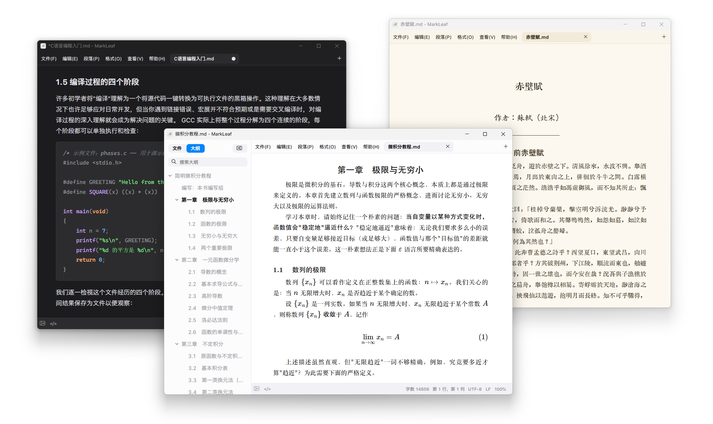

# MarkLeaf

[简体中文](../README.md) | [English](./README.en.md) | [繁體中文](./README.zh-TW.md)

これは、シンプルなインターフェースと組版を追求する、ネイティブで軽量な Markdown ビジュアルエディターです。思考、読書、執筆に集中できる空間を提供します。

このプロジェクトは、もともと [fcz](https://github.com/zhuanshunjishi2017) によって開始・制作されました。初期版は Windows のみをサポートしていましたが、その後 [Na Bian](https://github.com/Na-Bian) が macOS 版のサポートを提供しました。現在、**Windows 版と macOS 版は同時に更新されています**。

## アプリケーションのスクリーンショット



## 機能紹介

### 豊富な組版スタイルと配色スキーム

#### **組版スタイル**

アプリケーションには、次のような豊富な組版スタイルが組み込まれています。

- **ウェブ**：画面での読書と日常の編集に適しています。多くのエディターで主流となっている Markdown レンダリングスタイルで、効率と明瞭さを追求しています。
- **印刷物**：印刷物でよく使われるセリフ体とゴシック体の組版を採用し、段落の両端揃え、初行インデント、中央揃えの見出し、広いページ余白によって、現代の書籍の組版効果を再現します。長文の執筆と読書に適しています。
- **LaTeX**：CMU フォントと LaTeX の document 文書に似た組版を採用しています。引用と警告ボックスは tcolorbox のスタイルにできるだけ近づけており、論文の執筆に適しています。
- **活字印刷**：特里王氏が制作した匯文・朝華シリーズのフォントと京華老宋体を採用し、印刷物のレイアウトを基礎に、よりレトロなスタイルを作り出します。

#### 配色スキーム

アプリケーションは、**複数のカラーテーマ**をサポートしています。明るいテーマと暗いテーマがあり、それぞれに独自のスタイルがあります。

配色スキームとレンダリングテーマは CSS スタイルであるため、**カラーテーマと組版スタイルを完全にカスタマイズ**できます。すべてのスタイルは **PDF/HTML/画像**へのエクスポートをサポートし、用紙サイズ、ページ余白、ヘッダー、フッターをカスタマイズできます。

### Markdown 構文のサポート

**Tiptap/ProseMirror** エディターコアを基盤とし、完全な CommonMark と GitHub Flavored Markdown 構文をサポートしています。

**そのほかのサポート**

- LaTeX 数式（KaTeX によるレンダリング）
- Mermaid ダイアグラム（SVG としてレンダリング）
- 脚注の定義、参照、移動
- GitHub スタイルの警告ボックス。メモ、ヒント、警告などを含み、各テーマで異なる表示効果があります
- <strong>（カスタム構文）</strong>画像と表のキャプション表示

### シンプルだが完全な操作ロジック

- **ワークスペース管理**：フォルダーをワークスペースとして開き、ツリービューまたはリストビューでファイルを表示し、名前または内容でドキュメントを検索できます。
- **マルチウィンドウとマルチタブ**：複数のウィンドウインスタンスを開き、ドキュメントを新しいウィンドウで開けます。また、同じウィンドウで複数のタブを開き、各タブがそれぞれのドキュメント内容を独立して管理します。
- **ソースモード**：CodeMirror 6 のソース編集モードを内蔵し、ビジュアル編集と Markdown ソースの間を即時に切り替えられます。
- **メニューとショートカット**：すべての段落操作と書式操作をコンテキストメニューと段落書式ボタンから実行できます。完全なショートカットカスタマイズシステムも備えています。
- **集中した読書と執筆**：集中モード、タイプライターモード、最小モードを提供し、全画面編集にも入れます。

## プラットフォームサポート


| プラットフォーム | 技術スタック                           | コードディレクトリ               |
| -------- | -------------------------------- | ----------------------- |
| Windows  | C# + .NET 10 WinForms + WebView2 | `apps/windows/MarkLeaf` |
| macOS    | Swift + AppKit + WKWebView       | `apps/macos`            |


両方のプラットフォームは同じエディターのフロントエンドとスタイルを共有し、アプリケーションは各プラットフォームのネイティブな方法で実装されています。

## プロジェクト構成

```text
markleaf/
├── apps/
│   ├── windows/                  # Windows ネイティブアプリケーション（C# WinForms）
│   │   ├── MarkLeaf/             #   メインプログラム（.NET 10 + WebView2）
│   │   └── setup/                #   Inno Setup インストーラー
│   └── macos/                    # macOS ネイティブアプリケーション（Swift AppKit）
│       ├── Sources/MarkLeaf/     #   メインプログラム
│       ├── Changelog/            #   製品変更履歴（4 言語）
│       └── script/               #   ビルド / リリーススクリプト
├── packages/
│   ├── editor-web/               # 共有エディターフロントエンド（Tiptap/ProseMirror + CodeMirror 6）
│   └── styles/                   # 共有組版 / テーマスタイル
├── MarkLeaf.slnx                 # Windows ソリューション
├── Directory.Build.props
├── global.json
├── appicon.png / fileicon.png    # 共有アプリケーションアイコン
├── LICENSE / THIRD-PARTY-NOTICES.md
└── README.md
```

## 技術アーキテクチャ

```text
apps/windows（C# WinForms）        apps/macos（Swift AppKit）
  メインウィンドウ / メニュー / ワークスペース / エクスポート       メインウィンドウ / ワークスペース / エクスポート
        │                                  │
        ├── packages/editor-web ───────────┤   共有フロントエンド（Tiptap + CodeMirror）
        ├── packages/styles ───────────────┤   共有印刷スタイル
        └── WebView2 / WKWebView       ─────┘   native-shim.js メッセージブリッジ
```

## ビルドと実行

### Web フロントエンドエディター

```bash
pnpm --dir packages/editor-web install --frozen-lockfile
pnpm --dir packages/editor-web build       # 出力先: packages/editor-web/dist
pnpm --dir packages/editor-web test        # Vitest フロントエンドテスト
```

### Windows

```powershell
dotnet restore .\MarkLeaf.slnx
dotnet build .\MarkLeaf.slnx --no-restore
dotnet run --project .\apps\windows\MarkLeaf\MarkLeaf.csproj
```

### macOS

```bash
# 一度だけ（フロントエンドのビルド + コンパイル + .app のパッケージ化 + 起動）
./apps/macos/script/build_and_run.sh

# リリースパッケージ（.app / ZIP / ブランド DMG / チェックサム）
./apps/macos/script/release/package.sh
```

## ライセンス

このアプリケーションは MIT ライセンスを採用しています。

## その他の説明

### フォント

一部のテーマでは特定のフォントが必要になる場合があります。以下のページからダウンロードできます。

- [Computer Modern シリーズのフォント](https://www.fontsquirrel.com/fonts/computer-modern)（LaTeX のデフォルト組版フォント）
- [匯文・朝華シリーズのフォントと京華老宋体](https://huozi.cool/)（鉛字印刷向け、特里王氏制作）
- [霞鶩文楷](https://github.com/lxgw/LxgwWenKai)（手記の組版向け、Lxgw 制作の優れたオープンソースフォント）

